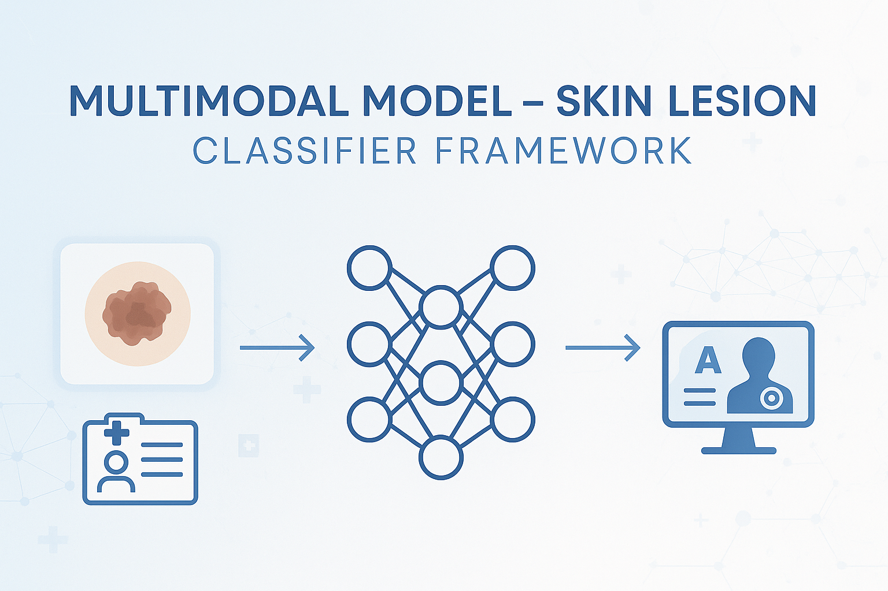
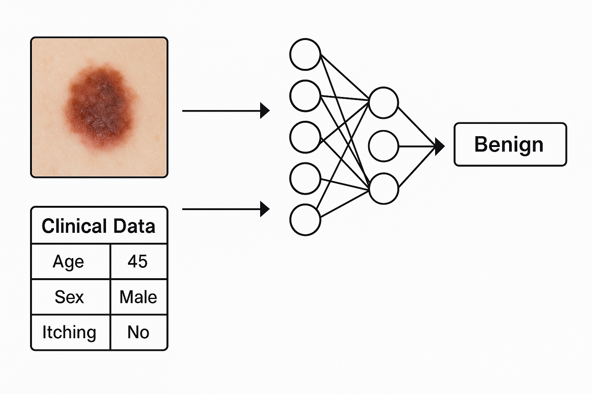
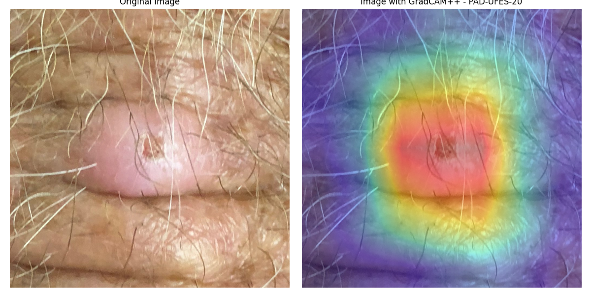

# Multimodal Model - Skin Lesion Classifier Framework



This repository contains a multimodal model for classifying skin lesions. The model integrates an image feature extractor (e.g., **VGG16**, **ResNet18**, **ResNet50**, **DenseNet169**, among others) with clinical data to form a powerful multimodal architecture. Also, on the latest updates, many transformers based on models have been included.

## 1. Preparing the Dataset

1. Download the **PAD-20** dataset provided by UFES.
2. Extract the files and move them to the `data/` directory of this project.

> **Note:** Ensure the folder structure is correct for the training script to properly recognize the files.

* This framework supports ISIC-2019, ISIC-2020, PAD-UFES-20 and PAD-UFES20-Extended datasets.

## 2. Setting Up the Environment

1. Create a new Conda environment:  
   ```bash
   conda create -n multimodal-env
   ```
2. Activate the newly created environment:  
   ```bash
   conda activate multimodal-env
   ```
3. Install the required dependencies (if not done already).  
   > **Tip:** If a `requirements.txt` file is available, simply run:  
   > ```bash
   > pip install -r requirements.txt
   > ```
   Otherwise, install the libraries manually as mentioned in the documentation.

# Configuration

Go to the 'conf' folder and create a .env file with the following variables:

- NUM_EPOCHS: Quantity of epochs to train the models.
- BATCH_SIZE: Batch size.
- K_FOLDS: Quantity of folds to be created.
- LIST_NUM_HEADS: List with the quantity of 'heads' to be used oon the models train process.
- COMMON_DIM: Vector size to be used as the projected vector on the visual and the textual feature vectors.
- DATASET_FOLDER_NAME: Name of the dataset folder
- DATASET_FOLDER_PATH: Folder path of the dataset
- UNFREEZE_WEIGHTS: Flag to indicating the freezing state of the weights
- LLM_MODEL_NAME_SEQUENCE_GENERATOR: Name of the LLM generator model when trainning with sentences.
- RESULTS_FOLDER_PATH: Folder path to indicate where the results will be saved in the end of the trainning process.

You can use the '.env-test' file as base to write your own '.env' file.


## 3. Training the Model




1. Choose the image feature extractor (such as **VGG16**, **ResNet18**, **ResNet50**, **DenseNet169**, etc.) in the training script.
2. Choose your metadata information preprocessor. It can be 'one-hot-encoder', "tab-transformer" or "bert-base-uncased". 
2.1. Choosing Feature Combination Methods

In the multimodal model, you can use multiple types of attention mechanisms or feature combination strategies. These methods help integrate different data modalities (e.g., image and metadata) effectively.

Below are the available methods and their corresponding configuration strings:
- Concatenation: ["concatenation"]
- MetaBlock: ["metablock"]
- No Metadata or No Metadata Without MLP: ["no-metadata", "no-metadata-without-mlp"]
- GFCAM (Weighted After Cross-Attention): ["weighted-after-crossattention"]
- Cross-Attention: ["crossattention"]
- Cross-Attention with Element-wise Gate: ["weighted"]
- RG-ATT (Intra-modal + Residual + Cross-Attention with Metadata): ["att-intramodal+residual+cross-attention-metadados"]
- Multiple Feature Combination Methods: [
    "weighted-after-crossattention",
    "cross-weights-after-crossattention",
    "crossattention",
    "concatenation",
    "no-metadata",
    "weighted",
    "metablock",
    "att-intramodal+residual",
    "att-intramodal+residual+cross-attention-metadados",
    "att-intramodal+residual+cross-attention-metadados+att-intramodal+residual"
]

2.1.2 Choosing the Visual Feature Extractor

You can freely select your preferred visual feature extractor by modifying the list_of_models parameter in the configuration.

Examples of available models:

- VGG16: ["vgg16"]
- ResNet-50: ["resnet-50"]
- DenseNet-169: ["densenet169"]
- DaViT (Tiny): ["davit_tiny.msft_in1k"]

To use multiple or all available models, you can include them as a list:
- list_of_models: ["nextvit_small.bd_ssld_6m_in1k", "mvitv2_small.fb_in1k", "coat_lite_small.in1k",
 "davit_tiny.msft_in1k", "caformer_b36.sail_in22k_ft_in1k",
 "beitv2_large_patch16_224.in1k_ft_in22k_in1k", "vgg16", 
 "mobilenet-v2", "densenet169", "resnet-50"]

Note: These combinations can be especially useful when training multiple model types across different datasets for enhanced multimodal performance.

Obs.: You can use these features combinations when trainning multiple models types based on different datasets.

3. Run the following command:  
`python3 src/scripts/benchmark/train_isic_2020.py`

4. Monitor the training process and metrics via **MLFlow** (if configured in the script).

## 4.1 Training a model using ISIC 2019 dataset

1. Change the dataset folder path diretory on 'src/scripts/data_preprocessing/preprocess_isic_2019.py' script and then run it to create the "metadata.csv" equivalent to this dataset.

2. Then, with the metadata.csv created, run the 'python3 src/scripts/benchmark/train_isic_2019.py' script to train the defined model.

## 4.2 Create your own mulmodalmodal model

You can create yor own models. Take the created model scripts as examples on the folder 'src/models'. Then, you import it to your 'src/train_pad_20.py' script.


## 5. Plotting the Model

1. Set the path to the model you want to visualize in the script.
2. Run the plot script:  
`python3 src/src/scripts/benchmark/plots/plot_model.py`

3. A plot or interactive graph of the model will be generated, depending on your configuration.

## 6. Exporting the Model to ONNX Format

1. In the `src/scripts/others/export_model_onnx.py` script, update the `model_path` variable to the desired model path.
2. Then, execute:  
`python3 src/others/export_model_onnx.py`

3. This will generate an ONNX file (default: `multimodal_model.onnx`).

> **Warning:** Do not alter the model architecture before exporting it. If changes are necessary, ensure you know the original architecture used for training, as any modifications might prevent proper conversion.

## 7. Visualizing the Converted Model

To inspect the ONNX file structure, use [Netron](https://netron.app/):  
```bash
netron multimodal_model.onnx
```
This will launch a graphical interface to explore the model’s layers.

## 8. Visualizing the MLFlow UI

To track training metrics, model versions, and saved artifacts, run:  
```bash
mlflow ui
```
The interface will be available at [http://localhost:5000](http://localhost:5000) (default port).

## 9. Statistical Tests

To perform a statistical test, edit the script `src/scripts/aggregation/average_metric_values.py`. You should update the list of visual feature extractors and their respective attention mechanisms according to the models you want to compare. 

Also, modify the `base_folder_path` variable to point to the directory containing the results of your models.

## 10. Methods based on CAM:

You can obtain the GradCAM++ heatmap based on the wanted model and the chosen inputs. Just change the models' folder path, backbone, and the inputs in the script `src/scripts/benchmark/interpretability/gradcam_plusplus.py`. Then just run the command in the terminal: `python3 src/scripts/benchmark/interpretability/gradcam_plusplus.py` 



### Contact

For questions or suggestions, feel free to open an **issue** or submit a **pull request**. Let us know how you’re using or improving this repository!